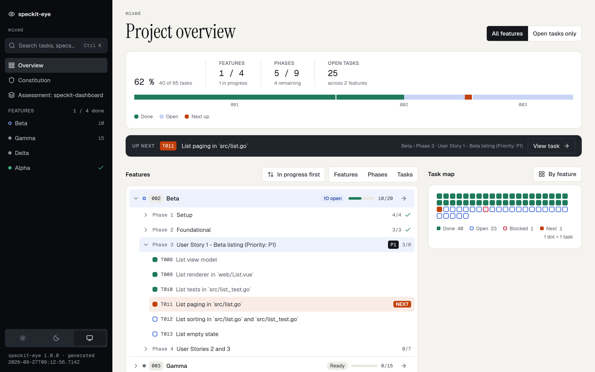

# speckit-eye

[](https://github.com/SerafAC/speckit-eye/actions/workflows/ci.yml)
[](https://www.npmjs.com/package/speckit-eye)
[](LICENSE)

A zero-setup progress dashboard for [GitHub Spec Kit](https://github.com/github/spec-kit)
projects. Point it at a project folder and open the printed address: you see
how far along the project is, which feature and phase are being worked on, and
which task comes next, without reading a single `tasks.md` by hand.

[Documentation](https://serafac.github.io/speckit-eye/) ·
[Project status & live demo](https://serafac.github.io/speckit-eye/status/)
(this repository's own specs, shown by speckit-eye)

<picture>
  <source media="(prefers-color-scheme: dark)" srcset="docs/assets/screenshot-dark.png">
  
</picture>

speckit-eye only reads your project. It never creates, changes, or deletes a
file in it; a static build writes only to the output folder you name.

## Features

- **Overview at a glance**: the overall percentage, features, phases and open
  tasks, a bar with one segment per feature, and an Up next bar naming the
  next task to work on
- **Feature tree**: every feature with its status, phases, user stories and
  tasks, in the order you choose (in progress first, number, least complete,
  name), opened to the depth you choose, with "Open tasks only" and warnings
  for `tasks.md` lines that do not follow the Spec Kit template
- **Task map**: one square per task, colored done, open, blocked or next;
  hover a square for its task, click it to find the task in the tree, or
  group the squares by feature
- **Feature pages**: one page per feature with tabs for its documents, a
  phase rail, task filters (open, tests, kind of file, text), and a detail
  panel with the task's files, what it is waiting on, "Copy ID" and a link to
  its line in `tasks.md`
- **Document reader**: every spec, plan, research note, contract, checklist,
  the constitution and assessments in a reading layout with a document list
  and "On this page"; specs following the Spec Kit template get a structured
  view with user stories, clarifications and requirements; "Raw markdown"
  shows the source
- **Light, dark or system theme**: switch in the sidebar; your choice is
  remembered
- **Search**: press ⌘K (Ctrl+K) to find tasks, features, documents and
  section headings
- **Live updates**: in serve mode, open pages follow changes to your files
  within about 2 seconds and stay as you left them
- **Static snapshot**: build the same pages as a static site, for example for
  GitHub Pages
- **Read-only and local**: it never changes your project, serve mode listens
  only on your own machine, and nothing is loaded from other servers
- **Works without JavaScript**: every page stays readable, and the tree,
  phases, tasks and document sections open and close with scripts turned
  off
- **Works on phones**: on a narrow screen the sidebar moves behind a menu

## Prerequisites

- Node.js 22 or later (it comes with `npx`)

## Usage

In a Spec Kit project folder:

```sh
npx speckit-eye --serve .
```

Then open the `Local:` address it prints (normally http://127.0.0.1:4747/).
Press Ctrl+C to stop.

The overview shows how far the project is, the next task, a tree of every
feature with its phases and tasks, and a task map with one square per task.
Open a feature from the sidebar to work through its tasks and read its
documents.

## Publish a snapshot

Build the same pages as a static site, for example in CI for GitHub Pages:

```sh
npx speckit-eye --build . --out _site --base /my-repo/
```

`--base` is the URL path the site is served under (default `/`). The hosted
snapshot shows when it was generated and has no live updates.

> [!WARNING]
> **A hosted build makes every spec, plan, research note, the constitution and
> every assessment readable by anyone who can reach the site, unless your host
> restricts access.**

See [Hosting a snapshot](docs/hosting.md) for a ready-to-copy GitHub Pages
workflow and notes for other hosts.

## Documentation

- [Documentation website](https://serafac.github.io/speckit-eye/): all the
  guides below, online
- [Usage](docs/usage.md): the overview, task map, feature pages, document
  reader, theme, search, and how the active feature is chosen
- [Hosting a snapshot](docs/hosting.md): static build options and a sample
  GitHub Pages workflow
- [Architecture](docs/architecture.md): how the tool is put together
- [Releasing](docs/releasing.md): how a new version is published to npm
- [Development](DEVELOPMENT.md): building, testing, and contributing
- [Changelog](CHANGELOG.md): what changed in each release

## Contributing

Bug reports, ideas and pull requests are welcome. Read the
[contributing guide](CONTRIBUTING.md) and the
[Code of Conduct](CODE_OF_CONDUCT.md) first. Please report security
vulnerabilities privately, as described in the [security policy](SECURITY.md).
