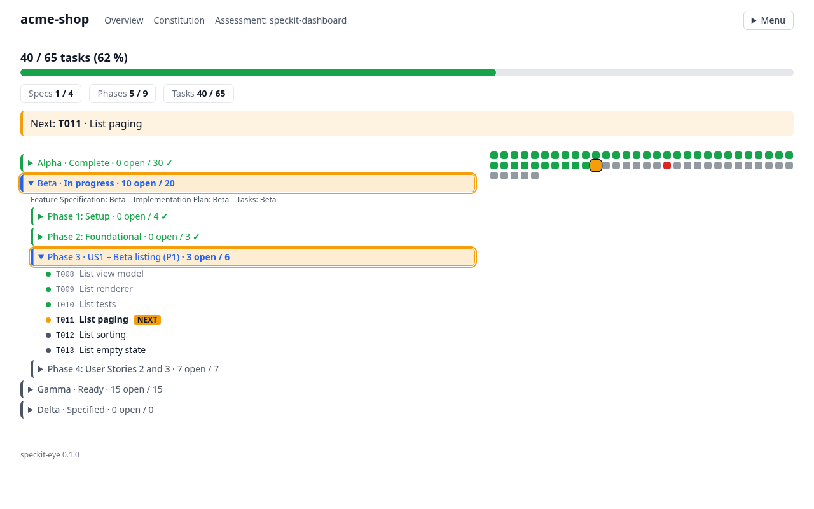

# speckit-eye

A zero-setup progress dashboard for [GitHub Spec Kit](https://github.com/github/spec-kit)
projects. Point it at a project folder and open the printed address: you see
how far along the project is, which feature and phase are being worked on, and
which task comes next, without reading a single `tasks.md` by hand.



speckit-eye only reads your project. It never creates, changes, or deletes a
file in it; a static build writes only to the output folder you name.

## Features

- **Overview at a glance**: one progress bar for the whole project, counters
  for completed specs, phases and tasks, and the next task to work on
- **Feature tree**: every feature with its stage, phases, user stories and
  tasks; the feature being worked on is expanded, finished ones are collapsed
- **Task grid**: one square per task, colored by state (done, current,
  blocked, not started); hover a square to see which feature and phase it
  belongs to
- **Live updates**: in serve mode, open pages follow changes to your files
  within about 2 seconds and keep your scroll position and expanded items
- **Every artifact readable**: specs, plans, research, contracts, checklists,
  the constitution and assessments open as rendered pages, at most two clicks
  from the overview
- **Static snapshot**: build the same pages as a static site, for example for
  GitHub Pages
- **Read-only and local**: it never changes your project, and serve mode
  listens only on your own machine
- **Works without JavaScript**: the overview, including expand and collapse,
  works with scripts turned off

## Prerequisites

- Node.js 22 or later (it comes with `npx`)

## Usage

In a Spec Kit project folder:

```sh
npx speckit-eye --serve .
```

Then open the `Local:` address it prints (normally http://127.0.0.1:4747/).
Press Ctrl+C to stop.

The overview shows an overall progress bar with counters for specs, phases,
and tasks, a tree of every feature with its phases and stories, and a grid
with one square per task.

## Publish a snapshot

Build the same pages as a static site, for example in CI for GitHub Pages:

```sh
npx speckit-eye --build . --out _site --base /my-repo/
```

`--base` is the URL path the site is served under (default `/`). The hosted
snapshot shows when it was generated and has no live updates.

> [!WARNING]
> **A hosted build makes every spec, plan, research note, the constitution and
> every assessment readable by anyone who can reach the site, unless your host
> restricts access.**

See [Hosting a snapshot](docs/hosting.md) for a ready-to-copy GitHub Pages
workflow and notes for other hosts.

## Documentation

- [Usage](docs/usage.md): what the overview shows, stage labels, colors, and
  how the active feature is chosen
- [Hosting a snapshot](docs/hosting.md): static build options and a sample
  GitHub Pages workflow
- [Architecture](docs/architecture.md): how the tool is put together
- [Development](DEVELOPMENT.md): building, testing, and contributing
- [Changelog](CHANGELOG.md): what changed in each release
