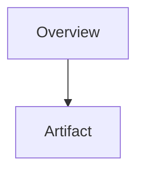

# Implementation Plan: Full Feature

Back to the [spec](./spec.md). The CLI is described in [cli](./contracts/cli.md#synopsis).
Source code: [src](../../src/index.js). A bad link: [x](javascript:alert(1)).
External docs: [docs](https://example.com).

## Summary table

| Module | Purpose |
|---|---|
| reader | reads files |
| render | writes pages |

## Checklist

- [x] Done item
- [ ] Open item
- [X] Also done

## Code

```js
const answer = 40 + 2;
console.log("<b>" + answer);
```

## Diagram



## Raw HTML

<script>alert(1)</script>


> A block quote about the plan.
